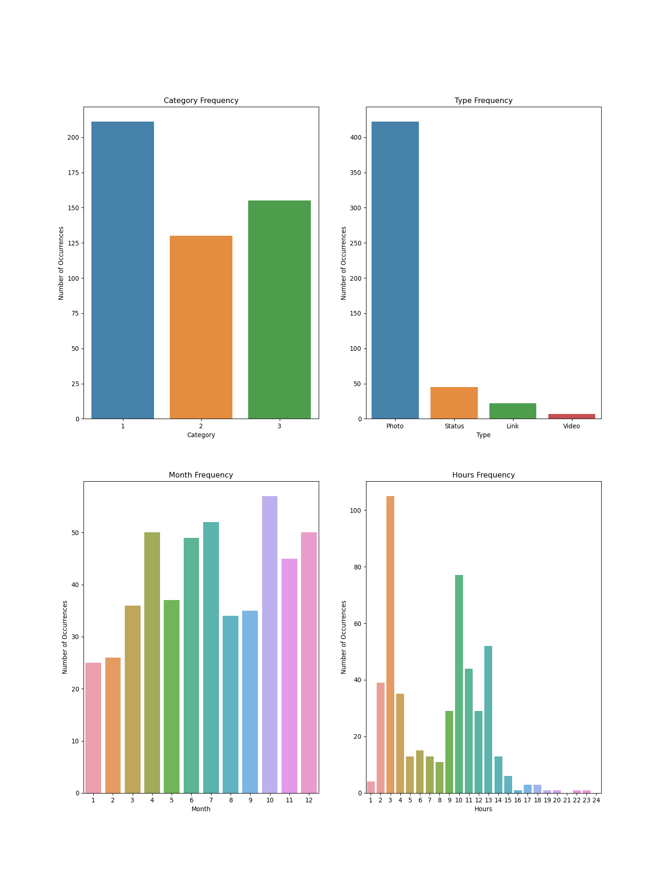

  


```python
import pandas as pd
import seaborn as sns
import matplotlib.pyplot as plt
mydata=pd.read_csv('E:/Angeline/Teaching/business analytics/constant trials-2020/descriptive/dataset_Facebook.csv')
type(mydata)
```

```
## <class 'pandas.core.frame.DataFrame'>
```

```python
mydata.shape
```

```
## (500, 11)
```

```python
mydata.head(5)
```

```
##    Category  Page total likes    Type  Post Month  Post Hour  Post Weekday  \
## 0         2            139441   Photo          12          3             4   
## 1         2            139441  Status          12         10             3   
## 2         3            139441   Photo          12          3             3   
## 3         2            139441   Photo          12         10             2   
## 4         2            139441   Photo          12          3             2   
## 
##    Paid  Lifetime Post Consumers  comment    like  share  
## 0   0.0                      109        4    79.0   17.0  
## 1   0.0                     1361        5   130.0   29.0  
## 2   0.0                      113        0    66.0   14.0  
## 3   1.0                      790       58  1572.0  147.0  
## 4   0.0                      410       19   325.0   49.0
```

```python
pd.set_option('display.max_columns',11)
mydata.head(5)
```

```
##    Category  Page total likes    Type  Post Month  Post Hour  Post Weekday  \
## 0         2            139441   Photo          12          3             4   
## 1         2            139441  Status          12         10             3   
## 2         3            139441   Photo          12          3             3   
## 3         2            139441   Photo          12         10             2   
## 4         2            139441   Photo          12          3             2   
## 
##    Paid  Lifetime Post Consumers  comment    like  share  
## 0   0.0                      109        4    79.0   17.0  
## 1   0.0                     1361        5   130.0   29.0  
## 2   0.0                      113        0    66.0   14.0  
## 3   1.0                      790       58  1572.0  147.0  
## 4   0.0                      410       19   325.0   49.0
```

```python
mydata.dtypes 
```

```
## Category                     int64
## Page total likes             int64
## Type                        object
## Post Month                   int64
## Post Hour                    int64
## Post Weekday                 int64
## Paid                       float64
## Lifetime Post Consumers      int64
## comment                      int64
## like                       float64
## share                      float64
## dtype: object
```

```python
mydata['Category'] = mydata['Category'].astype(str)
mydata['Type'] = mydata['Type'].astype(str)

#Month displayed in order in plots
from pandas.api.types import CategoricalDtype
month_list = pd.Series(range(1,13))
month_cat = pd.Categorical(mydata['Post Month'], categories=month_list)
cat_type = CategoricalDtype(categories=month_list, ordered=True)
mydata['Post Month'] = mydata['Post Month'].astype(cat_type)

from pandas.api.types import CategoricalDtype
hr_list = pd.Series(range(1,25))
month_cat = pd.Categorical(mydata['Post Hour'], categories=hr_list)
cat_type = CategoricalDtype(categories=hr_list, ordered=True)
mydata['Post Hour'] = mydata['Post Hour'].astype(cat_type)

mydata['Post Weekday'] = mydata['Post Weekday'].astype(str)
mydata['Paid'] = mydata['Paid'].astype(str)
mydata.dtypes 

```

```
## Category                     object
## Page total likes              int64
## Type                         object
## Post Month                 category
## Post Hour                  category
## Post Weekday                 object
## Paid                         object
## Lifetime Post Consumers       int64
## comment                       int64
## like                        float64
## share                       float64
## dtype: object
```

```python
mydata.isna().any()

#Paid , like, share have missing values
```

```
## Category                   False
## Page total likes           False
## Type                       False
## Post Month                 False
## Post Hour                  False
## Post Weekday               False
## Paid                       False
## Lifetime Post Consumers    False
## comment                    False
## like                        True
## share                       True
## dtype: bool
```

```python
null_rows = mydata[mydata.isnull().any(axis=1)]
null_rows
```

```
##     Category  Page total likes   Type Post Month Post Hour Post Weekday Paid  \
## 111        1            136736  Photo         10         8            6  0.0   
## 120        1            136393  Photo         10         9            7  0.0   
## 124        1            136393  Photo         10         6            7  0.0   
## 164        1            135428  Photo          9        10            5  0.0   
## 
##      Lifetime Post Consumers  comment  like  share  
## 111                       37        0   NaN    NaN  
## 120                      271        0   2.0    NaN  
## 124                      246        0   7.0    NaN  
## 164                      251        0  18.0    NaN
```

```python
mydata=mydata.dropna()
mydata.shape

#5 rows deleted
```

```
## (496, 11)
```

```python
mydata.describe()

```

```
##        Page total likes  Lifetime Post Consumers     comment         like  \
## count        496.000000               496.000000  496.000000   496.000000   
## mean      123088.987903               803.590726    7.542339   178.967742   
## std        16295.904371               884.379330   21.255593   324.108473   
## min        81370.000000                 9.000000    0.000000     0.000000   
## 25%       111620.000000               335.000000    1.000000    57.000000   
## 50%       129600.000000               555.000000    3.000000   101.000000   
## 75%       136393.000000               966.000000    7.000000   188.000000   
## max       139441.000000             11328.000000  372.000000  5172.000000   
## 
##             share  
## count  496.000000  
## mean    27.266129  
## std     42.613292  
## min      0.000000  
## 25%     10.000000  
## 50%     19.000000  
## 75%     32.250000  
## max    790.000000
```

```python
import seaborn as sns
import matplotlib.pyplot as plt

category_count = mydata['Category'].value_counts()
type_count = mydata['Type'].value_counts()
mnth_count = mydata['Post Month'].value_counts()
hr_count = mydata['Post Hour'].value_counts()

figure, axes = plt.subplots(nrows=2, ncols=2,figsize=(15,20))
axes[0, 0].set_title('Category Frequency')
axes[0, 0].set(xlabel='Category', ylabel='Number of Occurrences')
```

```
## [Text(0, 0.5, 'Number of Occurrences'), Text(0.5, 0, 'Category')]
```

```python
axes[0, 1].set_title('Type Frequency')
axes[0, 1].set(xlabel='Type', ylabel='Number of Occurrences')
```

```
## [Text(0, 0.5, 'Number of Occurrences'), Text(0.5, 0, 'Type')]
```

```python
axes[1, 0].set_title('Month Frequency')
axes[1, 0].set(xlabel='Month', ylabel='Number of Occurrences')
```

```
## [Text(0, 0.5, 'Number of Occurrences'), Text(0.5, 0, 'Month')]
```

```python
axes[1, 1].set_title('Hours Frequency')
axes[1, 1].set(xlabel='Hours', ylabel='Number of Occurrences')

```

```
## [Text(0, 0.5, 'Number of Occurrences'), Text(0.5, 0, 'Hours')]
```

```python
sns.barplot(category_count.index, category_count.values,
            alpha=0.9,ax = axes[0][0])
sns.barplot(type_count.index, type_count.values, alpha=0.9,ax = axes[0][1])
sns.barplot(mnth_count.index, mnth_count.values, alpha=0.9,ax = axes[1][0])
sns.barplot(hr_count.index, hr_count.values, alpha=0.9,ax = axes[1][1])
plt.show()
```




 
 
